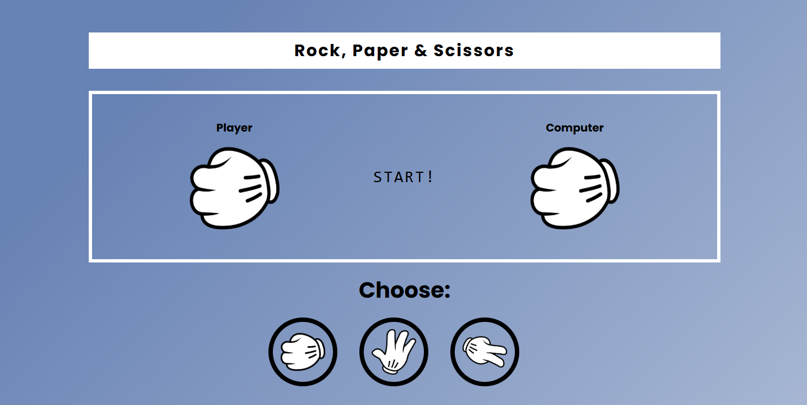
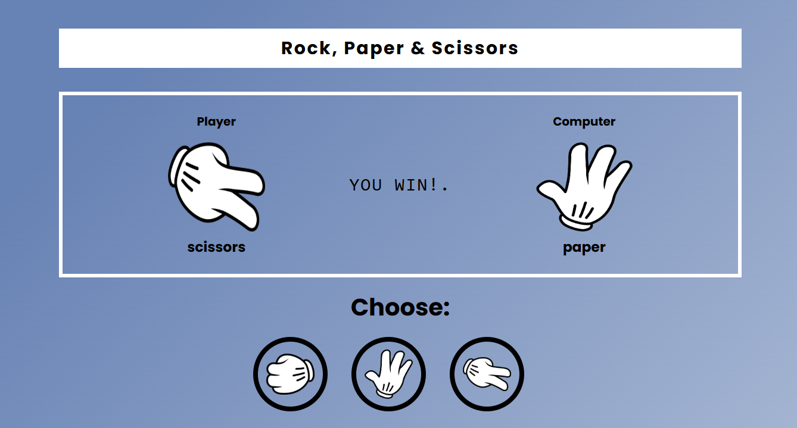
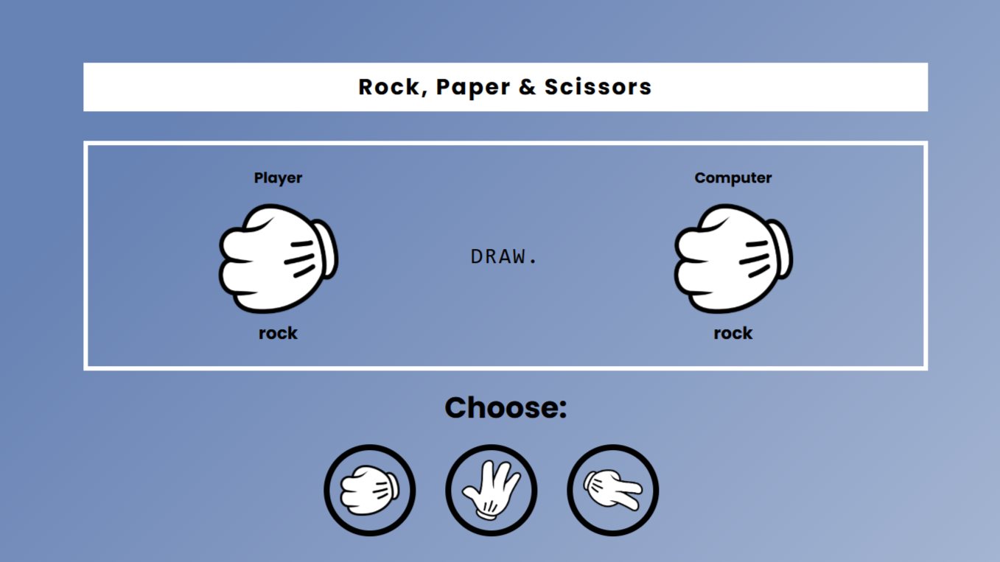

# rock_paper_scissor

A simple Rock Paper Scissors game built using **HTML, CSS, and JavaScript**.

## 🎮 Live Demo
[Click here to play](https://tejakiran003.github.io/rock_paper_scissors/) 

## 📌 Features
- Classic Rock Paper Scissors gameplay.
- Interactive UI with images for better experience.
- Displays win, lose, or draw results visually.
- Responsive design for different screen sizes.

## 🖼️ Screenshots
### Game Previews:
- **Start Screen:**
  
- **Win Screen:**
  
- **Lose Screen:**
  
- **Draw Screen:**
  

## 📂 Project Structure
```
rockpaperscissors
├── app.js           # JavaScript logic for the game
├── images           # Images used in the game
│   ├── paper.png
│   ├── previews    # Screenshots for different game results
│   │   ├── draw.png
│   │   ├── lose.png
│   │   ├── start.png
│   │   ├── win.png
│   ├── rock.png
│   └── scissors.png
├── index.html       # Main HTML file
└── styles.css       # Styling for the game
```

## 🚀 How to Run
1. Clone this repository:
   ```bash
   git clone https://github.com/tejakiran003/rock_paper_scissors.git
   ```
2. Open the **index.html** file in your browser.

## 🔧 Technologies Used
- **HTML** – Structure of the game
- **CSS** – Styling and layout
- **JavaScript** – Game logic and interactivity

## 💡 How to Play
1. Choose **Rock**, **Paper**, or **Scissors**.
2. The computer randomly selects one of the three options.
3. The winner is decided based on:
   - **Rock beats Scissors**
   - **Scissors beats Paper**
   - **Paper beats Rock**
4. The result is displayed on the screen.


## ✨ Author
Developed by **[Teja Kiran]**
